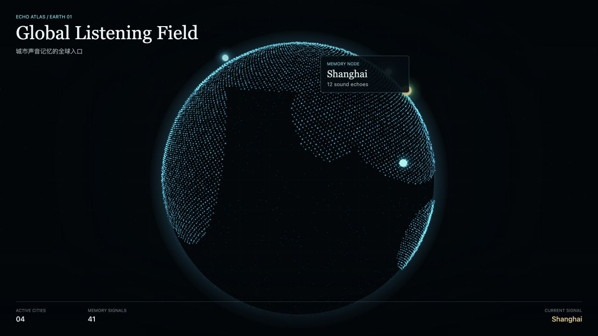
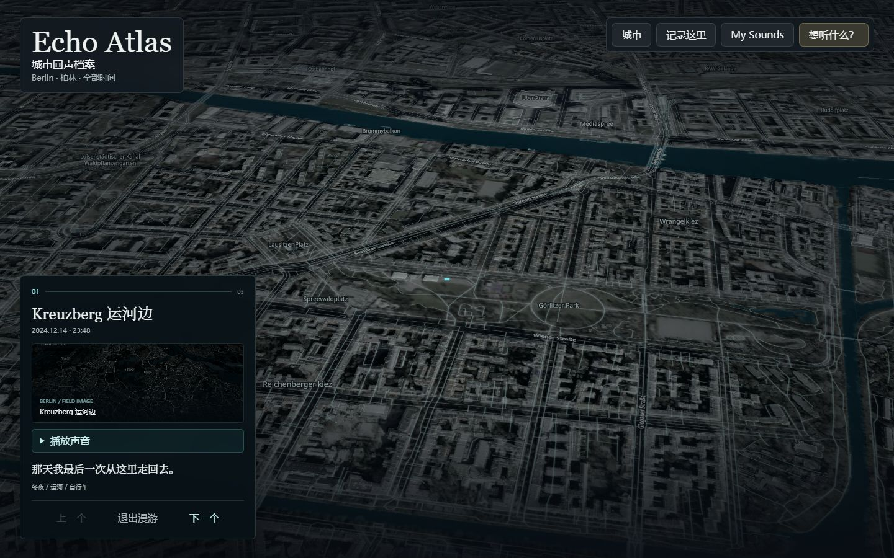
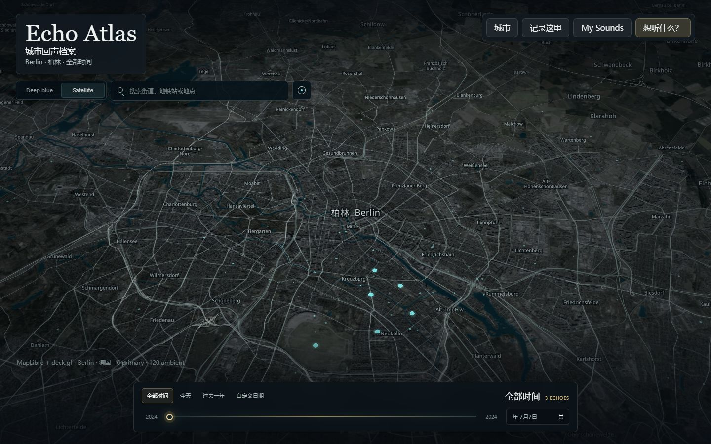

# Echo Atlas

**A living sound atlas of places, time and human memory.**

**一张连接地点、时间与人的声音记忆地图。**

## 🎧 Live Demo

### [Open Echo Atlas →](https://yangzi831.github.io/echo-atlas-demos/)

Echo Atlas 不是告诉你一个地方“有什么”，而是让你听见一个地方曾经是什么样。

用户可以从全球声音地球进入不同城市，在真实地图中探索某个街道、某个时间留下的声音；也可以录下自己的声音、照片和一句话，慢慢建立属于自己的声音地图。

## Why Echo Atlas

视觉地图保存位置，但很多关于一个地方的感受来自声音。

雨、地铁、市场、脚步和夜晚街道，这些非常普通的声音也构成了城市和个人记忆。Echo Atlas 将地点、时间、声音与人的叙述放在同一张地图上，让不同时间的人通过同一个地方相遇。

## Experience

**01 · Global Listening Field**

从粒子地球进入一个城市。

**02 · Explore a Place**

搜索城市、街道或地点，探索附近留下的声音。

**03 · Listen Across Time**

通过时间轴听同一座城市在不同时间留下的声音。

**04 · Record Here**

用录音、图片和一句话组成一条 Sound Memory。

**05 · My Sounds**

把自己的采样重新放回 Atlas 中，查看逐渐形成的个人声音轨迹。

## Current Demo

比赛版本目前重点策展了六座城市：

- Shanghai
- Berlin
- Beijing
- Singapore
- Tokyo
- New York

产品本身支持搜索其他城市、街道、地址和地点。这六座城市是当前 Demo 的主要声音种子包，Global Earth 也提供更多可浏览地点作为世界入口。

## Demo Views

| Global Listening Field | Dark Satellite City Map |
| --- | --- |
|  |  |

| Listening Journey | My Sounds on the Atlas |
| --- | --- |
|  |  |

## AI / Agent

Echo Agent 的目标不是生成一段介绍文案，而是理解用户想听什么，并操作地图、时间和声音集合，组织一条 listening journey。

> “I left Berlin a year ago. Sometimes I still miss it.”

Echo 会找到相关地点与时间，让地图进入 Berlin，并组织一段可以依次聆听的声音漫游。

**AI guides. People leave the memories.**

## Tech

- React
- TypeScript
- Vite
- MapLibre GL JS
- deck.gl
- Three.js
- MapTiler Geocoding / map data

## Local Development

```bash
npm install
npm run dev
```

需要完整 MapTiler 地图与地点搜索时，在项目根目录创建 `.env.local`：

```env
VITE_MAPTILER_KEY=
```

不要提交 `.env.local` 或任何真实 API Key。

生产构建：

```bash
npm run build
```

## Status

Echo Atlas 是一个 hackathon prototype，当前重点是验证声音记忆系统的产品体验、视觉语言与核心交互闭环。Demo 已支持浏览器真实录音、实时声音特征与 Visual Imprint、位置与时间记录、本地持久化，以及统一的 Listening / Visual Listening 体验；公共内容仍以策展 seed data 为主。

## Future

- Real user sound storage
- Richer historical sound archives
- Weather and contextual layers
- Cross-time listening
- Personal sound atlas
